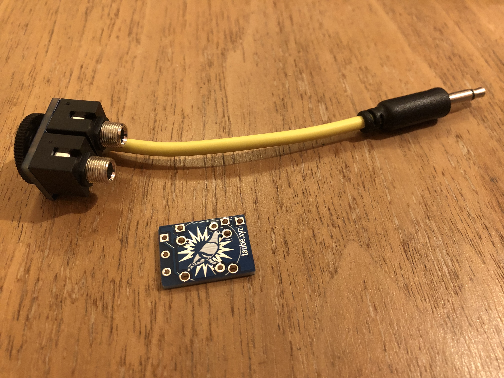
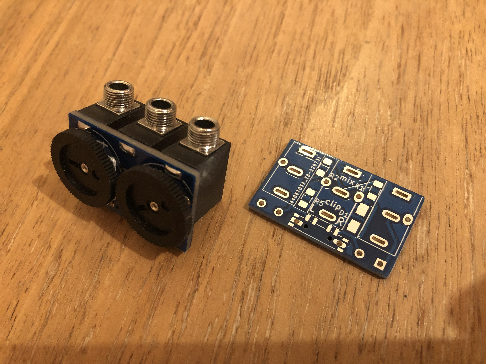

# passive Taube
Here are some passive mini-modules with 3.5mm Jacks. Feel free to use them as you like.

The crossfader is the most simple schematic for a potentiometer.

Here is a Picture of the soldered passive mixer with an integrated Clipper.

License for this hardware: [CC BY-SA 4.0](https://creativecommons.org/licenses/by-sa/4.0/)